# Practica servidor web
## 1. Titulo
Conexion de Redes de contenedores y wordpress
## 2. Tiempo de duración
8 horas 
## 3. Fundamentos:
     Redes de contenedores: Las redes de contenedores son sistemas que permiten la comunicación entre contenedores y otros componentes de una infraestructura, tanto en el mismo host como a través de múltiples hosts. Estas redes proporcionan aislamiento, control del tráfico y gestión de la comunicación entre aplicaciones distribuidas (Merkel, 2014).
     
     Puertos: un puerto es un punto virtual de conexión a través del cual se envía o recibe información de un dispositivo de red. Los puertos permiten que múltiples servicios operen simultáneamente en una misma dirección IP sin conflictos (Comer, 2018).
     
     Ip: es un identificador numérico único asignado a cada dispositivo conectado a una red que utiliza el Protocolo de Internet. Sirve para identificar y localizar dispositivos en una red y permitir la comunicación entre ellos (Forouzan, 2017).
     
     Conexion de redes de contenedores:mplica la configuración de entornos de red para contenedores, permitiendo que se comuniquen entre sí o con recursos externos. Esta conexión puede realizarse mediante puentes, redes overlay o drivers personalizados de red, proporcionando flexibilidad y escalabilidad a las aplicaciones (Turnbull, 2014).
     
      CMS:  es una aplicación que permite crear, editar, organizar y publicar contenido digital en un sitio web sin tener que programar directamente.

     Wordpress: es un sistema de gestión de contenidos de código abierto, usado para crear y administrar sitios web fácilmente sin necesidad de conocimientos técnicos profundos. Está desarrollado en PHP y usa MySQL como base de datos.

     Variables de entorno: son pares clave-valor que se utilizan para configurar el comportamiento de los contenedores sin modificar el código. En el caso de WordPress en Docker, se usan para conectar con la base de datos, por ejemplo:

   
  
## 4. Conocimientos previos.
   
Para realizar esta practica el estudiante necesita tener claro los siguientes temas:
- Contenedores.
- Puerto de salida.
- Ip.
- Comandos para creacion de redes de contenedores.
- Uso de imagenes en docker 
- Configuracion para conectar contenedores

## 5. Objetivos a alcanzar
- Implementar redes de contenedores en Docker para permitir la comunicación entre aplicaciones contenerizadas, comprendiendo los diferentes tipos de redes disponibles.

- Entender el concepto de redes de contenedores.

- Conectar dos contenedore para formar las redes.

- Crear wordpress dentro de un contenedor

- Configurar variables de entorno en la creación de los contenedores para establecer parámetros esenciales como usuario, contraseña y nombre de la  base de datos

- Implementar redes personalizadas en Docker para permitir la comunicación segura entre los contenedores de base de datos y WordPress.

- Gestionar volúmenes de Docker para asegurar la persistencia de datos tanto para la base de datos como para los archivos de WordPress.
## 6. Equipo necesario:
  
- Computador con sistema operativo Windows/Linux
- Plataforma Docker playground
- Docker hub

## 7. Material de apoyo.
   
- Documentacion de tendencias tecnologicas.
- Docker desktop
- Videos ilustrativos
- Documentacion sobre comandos para la creacion de contenedores wordpress.
  
## 8. Procedimiento
Paso 1:Crear una red 
 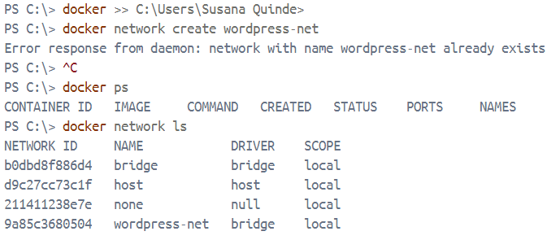

Paso 2:Descargar la imagen para wordpress   
 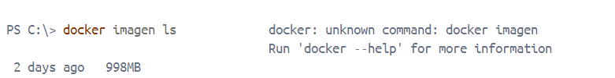

Paso 3:Crear un volumen para wordpress. 

paso 4: Descargar imagen de mysql 
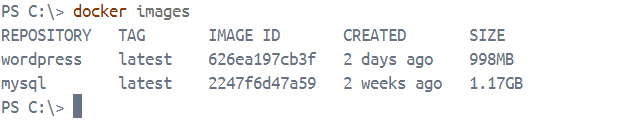

paso 5: Crear un volumen para mysql 
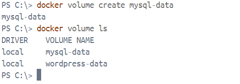

paso 6: Crear un contenedor para mysql 
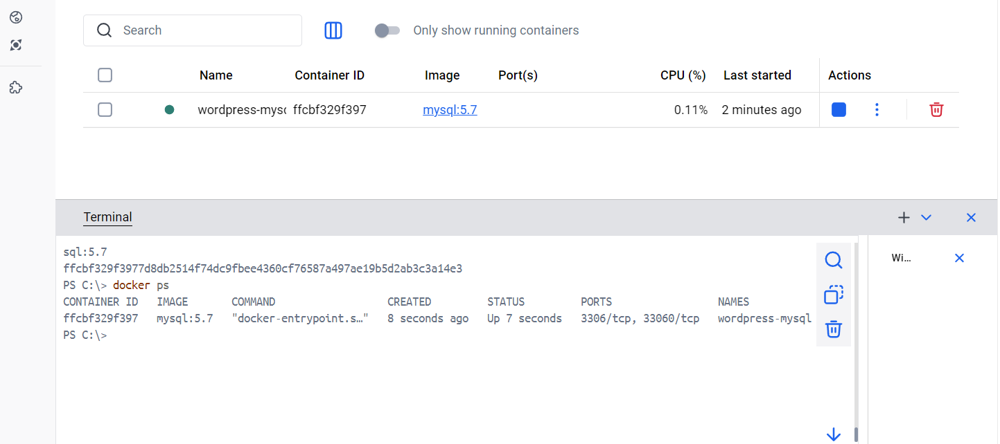

paso 7: Descargar imagen para phpmyadmin 
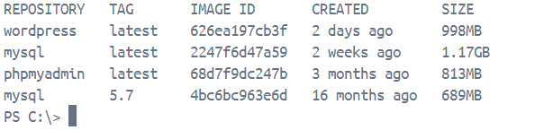

paso 8: Crear un contenedor para phpmyadmin usando el puerto 8080 
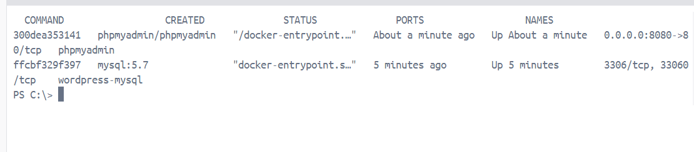

paso 9:Crear un contenedor de wordpress usando el puerto 8000
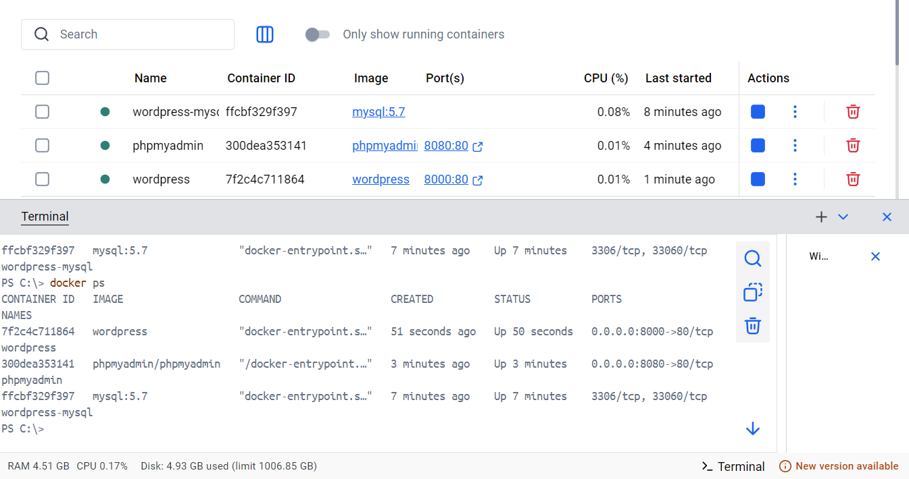

paso 10: Revicion de la interfaz segun puerto 8000 
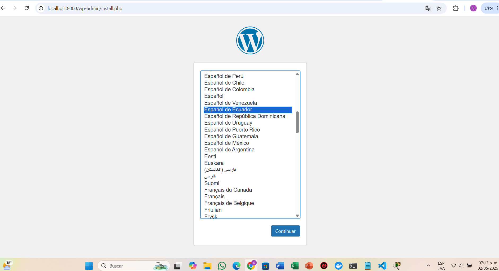

paso 11: Revicion de la interfaz segun puerto 8080 
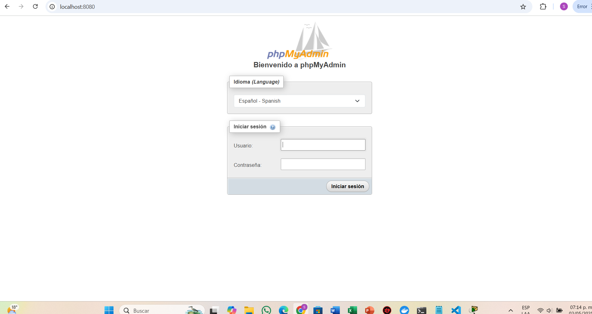

paso 12: Diagrama con puertos
 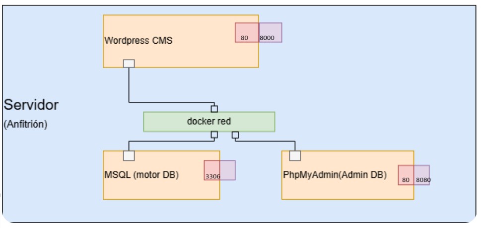

## 9. Resultados esperados:
    
Despues de esta práctica es entender cómo desplegar una aplicación web real como WordPress utilizando contenedores Docker.

## 10. Bibliografía
    
Docker Inc. (2024). Docker Documentation. https://docs.docker.com/

Docker Inc. (2024). What is Docker?. https://www.docker.com/resources/what-container/

Redondo, M. A., & Ortega, M. (2019). Sistemas de gestión de contenidos (CMS). En M. A. Redondo (Ed.), Ingeniería Web (pp. 111–130). McGraw-Hill.

Sturtz-Havill, M. (2022). Professional Docker. Wiley.

Turnbull, J. (2021). The Docker Book: Containerization is the new virtualization (5ª ed.). James Turnbull.

WordPress Foundation. (2024). WordPress.org. https://wordpress.org/

audio:

<audio controls>
  <source src="media/nota.ogg" type="audio/ogg">
 
</audio>
